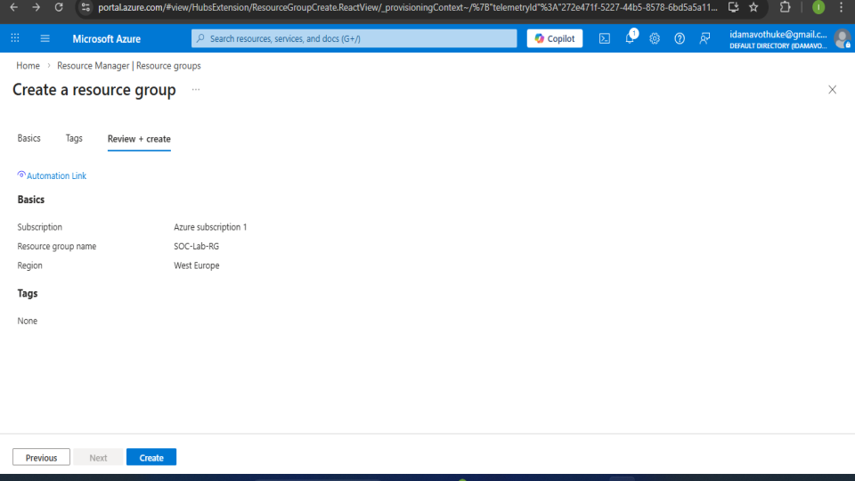
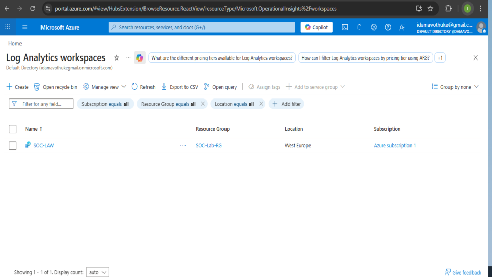
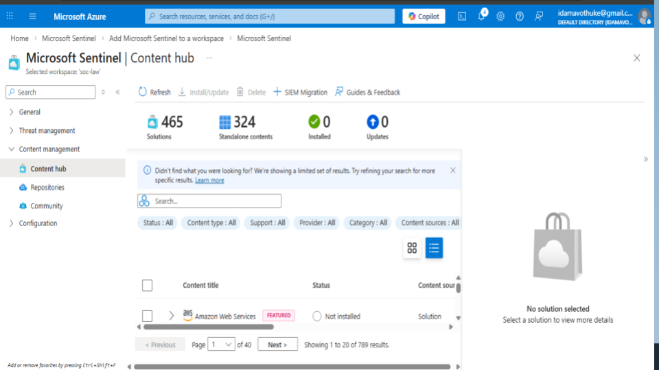
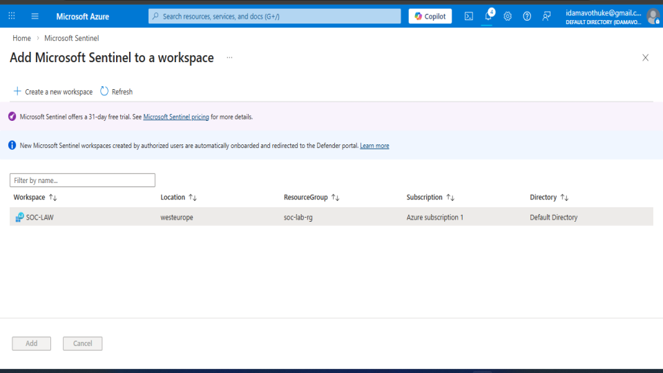
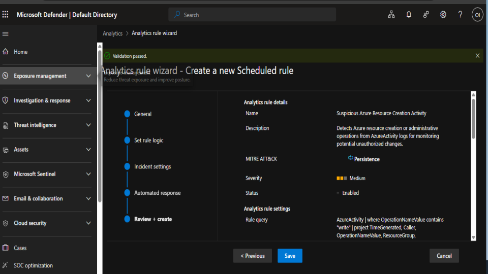
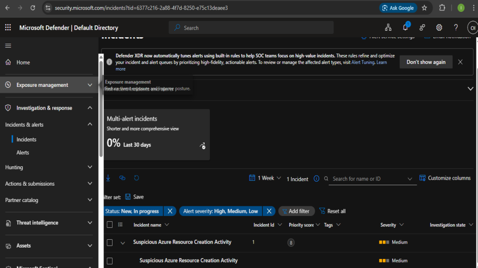
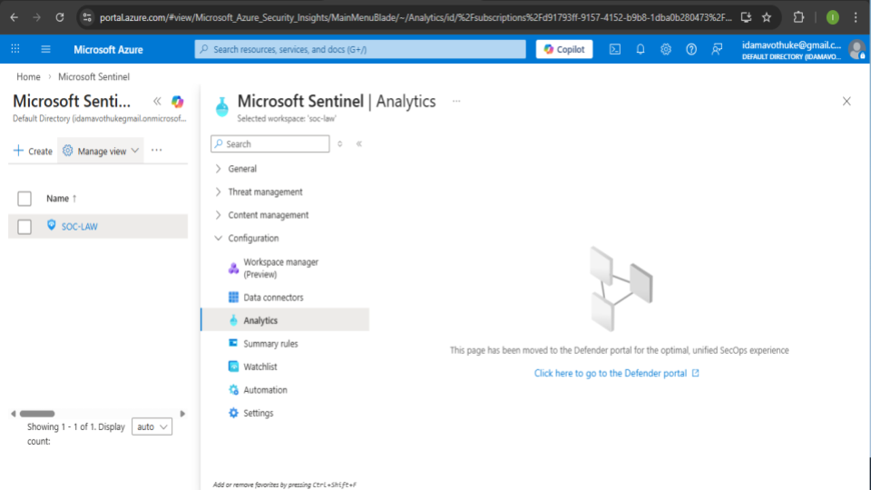
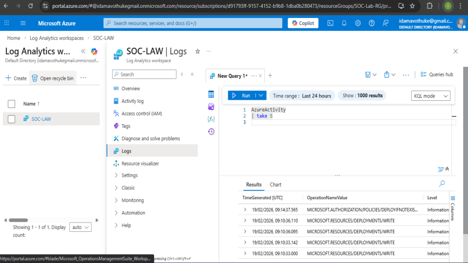
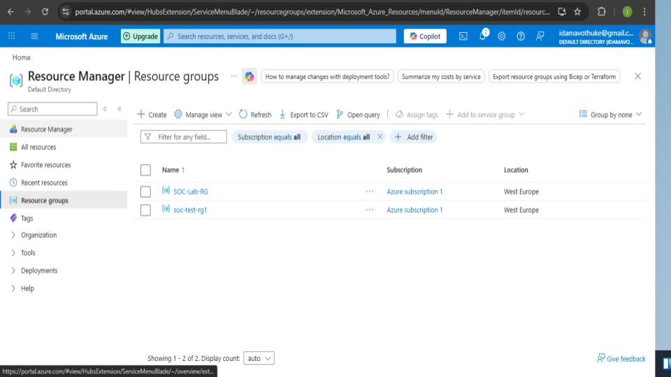
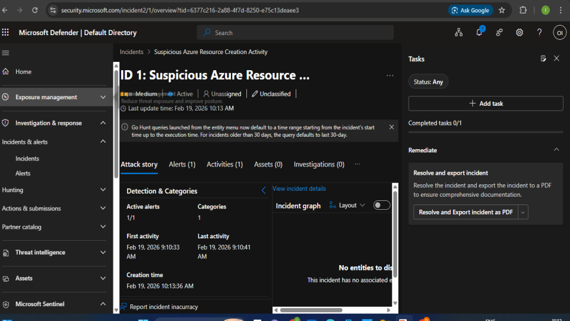

## 📌 Cloud-Based SIEM Implementation Using Microsoft Sentinel

##🔎 Project Overview

This project demonstrates the deployment and configuration of a cloud-based Security Information and Event Management (SIEM) solution using Microsoft Sentinel in Microsoft Azure.

The objective was to:

- Deploy Azure resources

- Enable log ingestion

- Create detection rules

- Simulate suspicious activity

- Generate and investigate security incidents

## 🏗️ Environment Setup

- Microsoft Azure subscription

- Resource Group (SOC-LAB-RG)

- Log Analytics Workspace

- Microsoft Sentinel enabled

- Azure Activity logs connected

## 📊 Log Ingestion Verification

Used KQL query to confirm log collection:

AzureActivity
| take 5

Verified that Azure Activity logs were successfully ingested into the Log Analytics Workspace.

## 🚨 Detection Engineering

Created a scheduled analytics rule:

- Rule Name: Suspicious Azure Resource Creation Activity

- Data Source: AzureActivity

- Detection Logic: OperationName contains "write"

- Severity: Medium

- MITRE ATT&CK mapping applied

## 🧪 Simulated Suspicious Activity

Created a new Azure Resource Group to simulate administrative activity and trigger detection.

## 🔔 Incident Generation

The analytics rule successfully generated an incident in Microsoft Sentinel.

## 🔍 Incident Investigation

Reviewed:

- Alert timeline
- Detection details
- Associated entities
- Incident status
- Demonstrated end-to-end detection and investigation workflow.

## 🛠️ Tools & Technologies

- Microsoft Azure

- Microsoft Sentinel

- Kusto Query Language (KQL)

## 🎯 Key Skills Demonstrated

- Cloud SIEM deployment

- Log ingestion configuration

- Detection rule creation

- Incident investigation

- Threat monitoring in cloud environments

### 📊 Evidence 

<h3 align="center">In this step, I created a Resource Group in Microsoft Azure called SOC-Lab-RG.
</h3>

    

<h3 align="center">After creating the Resource Group, I verified that it was successfully deployed.
</h3>

    

<h3 align="center">After setting up the Resource Group, the next step was creating a Log Analytics Workspace.
</h3>

    

<h3 align="center">After creating the Log Analytics Workspace, the next step was enabling Microsoft Sentinel.
</h3>

    

<h3 align="center">After enabling Microsoft Sentinel, the next step was exploring the Content Hub.
</h3>

    

<h3 align="center">After accessing the Content Hub, I installed the Azure Activity solution.
</h3>

    

<h3 align="center">After installing the Azure Activity solution, I configured an Azure Policy to ensure that activity logs are streamed to the Log Analytics Workspace.</h3>

    

<h3 align="center">After enabling Microsoft Sentinel, I navigated to the Analytics section to manage detection rules.
</h3>

    

<h3 align="center">After assigning the Azure Policy, I verified that logs were successfully ingested into the Log Analytics Workspace.
</h3>

    

<h3 align="center">After confirming successful log ingestion, I configured a scheduled analytics rule in Microsoft Sentinel to monitor suspicious Azure resource creation activity</h3>

    

<h3 align="center">To test the detection capability of Microsoft Sentinel, I simulated administrative activity by creating a new resource group in Azure.</h3>

    

<h3 align="center">After creating the analytics rule and simulating resource creation activity, Microsoft Sentinel automatically generated an incident.</h3>

    

<h3 align="center">After the alert was generated, I opened the incident in Microsoft Sentinel to investigate further</h3>

    

## Investigation Summary

After creating a custom analytics rule and simulating Azure resource creation activity, Microsoft Sentinel successfully generated an incident alert titled:

**"Suspicious Azure Resource Creation Activity"**

### Investigation Findings
- The alert was triggered immediately after the simulated resource creation activity.
- Activity logs confirmed that a new Azure resource was created within the monitored environment.
- The analytics rule functioned as intended and correctly detected the activity.

### Conclusion
This incident was classified as a **True Positive** because the alert accurately matched the simulated activity performed during the lab exercise. The detection demonstrated the effectiveness of Microsoft Sentinel analytics rules in identifying potentially suspicious cloud resource creation events.
